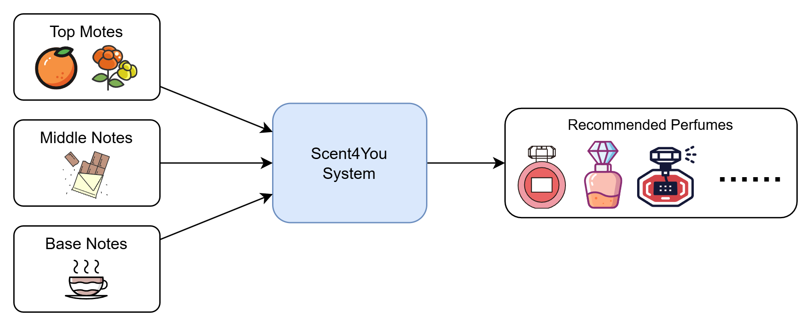
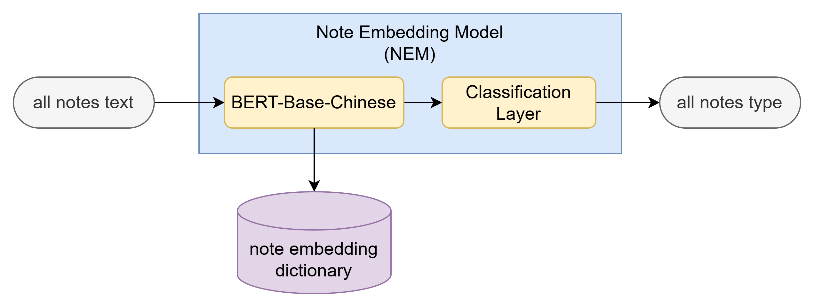
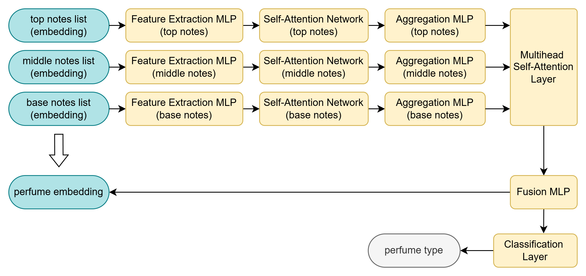
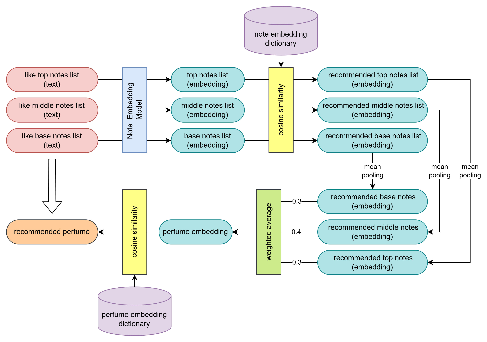
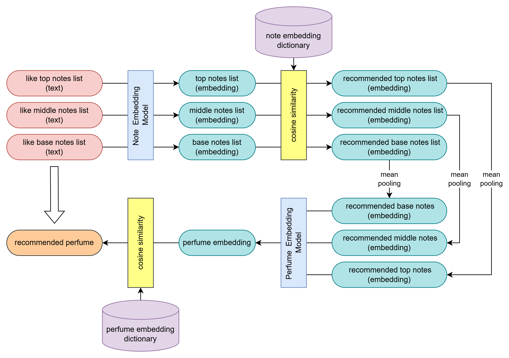

# Scent4You: A Perfume Recommendation System

Scent4You is a neural network-based perfume recommendation system. By building Scent Note Embedding (NEM) and Perfume Embedding Model (PEM), we map discrete fragrance ingredients and complex perfume structures into continuous vector spaces. This enables the system to understand concrete notes like "rose" and "sandalwood" and capture abstract olfactory semantics such as "woody" and "fresh," providing precise recommendations from natural language descriptions.

## Overview

- **Goal**: Convert users’ preferred top/middle/base notes into vector representations and retrieve the most similar Top-10 perfumes currently available for sale.
- **Input**: Input is Chinese note terms (top/middle/base).
- **Output**: Output is a candidate perfume list with similarity scores.

## Project Structure

| Folder/File | Description | Purpose |
| :--- | :--- | :--- |
| **Core** | | |
| `Scent4You.ipynb` | Main entry | Integrates data collection, cleaning, visualization and model traning, recommendation demos. |
| **Modules** | | |
| `1976_data_*.ipynb` | Data processing | Crawling (collect) and cleaning (clean) scripts. |
| `note_type_*.ipynb` | Note mapping | Cleaning scent note types and mapping logic. |
| `*_embedding_*.ipynb` | Model training and evaluation | Train and evaluate Note Embedding and Perfume Embedding models. |
| `*_recommendation_*.ipynb` | Recommendation | Implement weighted average (wa) and neural network (nn) strategies. |
| `vs.ipynb` | Visualization | In-depth market and data analysis. |
| **Resources** | | |
| `data/` | Datasets | Cleaned perfume data (.csv) and embedding dictionaries. |
| `models/` | Model weights | Pretrained PyTorch models (.pth). |
| `html/`, `img/` ,`PCA/` ,`TSNE/`| Static assets | Generated interactive charts and images. |
| `history/`| Data backup | Backup old version data. |

## Features
**Personalized recommendations**: Generate Top-10 perfume suggestions based on top/middle/base note preferences.

**Dual strategies**: Perfume vectors were constructed using a weighted average method and a neural network-based PEM model.

**In-catalog retrieval**: Cosine similarity search over the perfume embedding dictionary.

**Visualization & analysis**: Market and data analysis notebooks (e.g., `vs.ipynb`).

**Chinese semantic support**: `bert-base-chinese` for Chinese note text embeddings (NEM).

## Technical Architecture


Input fragrance text is converted to note embeddings via NEM. Top/middle/base notes are mapped to vectors and fed into PEM for feature extraction and attention aggregation. Multi-head attention fuses inter-layer interactions into a unified perfume embedding used for classification and similarity search.

### Note Embedding (NEM)
Fine-tuned bert-base-chinese converts note names to 768-dimensional vectors; after convergence over 10 epochs, the epoch-9 model is used to generate embeddings.



### Perfume Embedding (PEM)
A hierarchical network (top/middle/base sub-networks, attention aggregation, and multi-head attention) produces a 128-dimensional perfume embedding for classification and recommendation.



### Recommendation
Use cosine similarity to match vectorized perfumes with vectorized user requirements; implementations include a weighted average (top/middle/base weights 0.3/0.4/0.3) or aneural network-based PEM.

#### Weighted Average Method


#### Neural Network Method


## Quick Start
### Prerequisites
Make sure you have Python and pip version 3.10 or above.

```shell
conda create -n s4y python=3.10
```

### Install Necessary Packages
```shell
pip install torch transformers scikit-learn pandas numpy matplotlib seaborn plotly networkx selenium webdriver-manager beautifulsoup4 tqdm wordcloud
```

### Download Models
Download `NEM.pth` and `PEM.pth` from [Google Drive](https://drive.google.com/drive/folders/188M7Jm3XoOrvLZH5gR6HTlOki1tPprWm?usp=sharing) and place them in the [models](models) folder.

### Start JupyterLab
```shell
pip install jupyter
jupyter lab
```

### Run
Open the file [Scent4You.ipynb](Scent4You.ipynb) in JupyterLab to run the entire project. The Data Collection section contains web crawling code (time-consuming and network-dependent). By default, skip it and use preprocessed data in the `data` directory.

If you only want to run the recommendation demo, please run [perfume_recommendation_nn.ipynb](perfume_recommendation_nn.ipynb) or [perfume_recommendation_wa.ipynb](perfume_recommendation_wa.ipynb) within JupyterLab.

### Usage Example
Find perfumes featuring "orange", "coffee", and "chocolate".

```python
# 1. Load Model & Data (ensure prerequisite cells for the Recommendation Model section are executed)
# 2. Define your preferences
like_top_notes = ["橙子"]   # Orange
like_mid_notes = ["咖啡"]   # Coffee
like_base_notes = ["巧克力"] # Chocolate

# 3. Get Top-10 recommendations
rc_perfumes = get_recommended_perfumes(like_top_notes, like_mid_notes, like_base_notes, top_k=10)
display(rc_perfumes)
```

## Limitations & Future Work
- Semantic ambiguity: Homonymous or near-synonym notes may cause embedding confusion.
- Data coverage: Limited coverage of perfumes currently available for sale.
- Cross-language mapping: Currently focused on Chinese; cross-language note mapping requires further improvement.
- Future directions: Incorporate user profiling and personalized weight learning, cold-start strategies, and broader in-catalog data sources.
